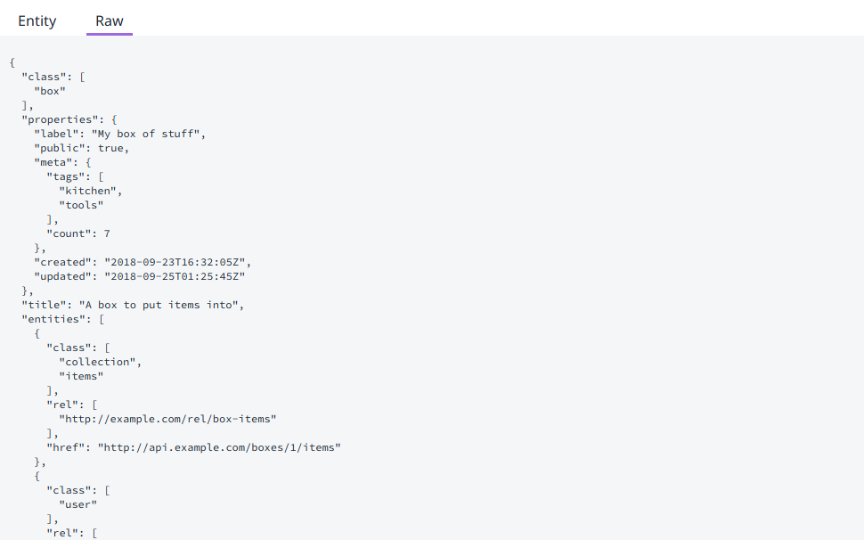

# Shipwreck

A simple generic web based UI for browsing any [Siren](https://github.com/kevinswiber/siren) Hypermedia API.

Enter the API root, to see all the entities properties, links, actions, and sub-entities rendered:

Or view the raw response:

## Usage

You can access [Shipwreck host on github.io](https://stephenwright.github.io/shipwreck/).

Or download the npm package and use it as a base for building your own UI.
